<!--
  GitHub profile README → repo: github.com/alisayedahmad/alisayedahmad  (file: README.md on main)
  DEPLOYMENT: also commit the folder  assets/banner.svg  to that same repo.
  The banner is a custom animated SVG (rotating ring, pulsing nodes, sweeping scan line).
-->

<p align="center">
  
</p>

<p align="center">
  <a href="https://linkedin.com/in/ali-sayedahmad"></a>
  <a href="mailto:ali.sayed@ensta.fr"></a>
  <a href="https://github.com/alisayedahmad"></a>
  
</p>

---

### 🧠 About

M.Sc. engineer from **ENSTA Bretagne – Institut Polytechnique de Paris** (AI & Observation Systems),
currently an R&D intern at **Schneider Electric Hive R&D** on *neuromorphic vision for predictive
maintenance*. I build vision and multimodal systems end-to-end — from raw data and controlled experiments
to compressed models running on edge hardware — with a strong bias toward **rigorous evaluation**:
ablations, controlled baselines, reproducibility.

```python
class AliSayedAhmad:
    def __init__(self):
        self.role   = "Deep Learning & Computer Vision Engineer"
        self.now    = "Event-camera fault detection for industrial motors @ Schneider Electric"
        self.focus  = ["Computer Vision", "Few-Shot / Meta-Learning",
                       "Edge & Neuromorphic AI", "Multimodal LLMs"]
        self.method = ["controlled baselines", "ablation studies", "reproducible pipelines"]
        self.status = "Open to Research / DL Engineer roles — US & Europe — from Oct 2026"
```

---

### 🛠️ Tech Stack

<div align="center">


<br/><br/>


</div>

---

### 🔬 Featured Projects

<table>
<tr>
<td width="50%" valign="top">
<h4>🔹 <a href="https://github.com/alisayedahmad/FewDetect">FewDetect</a></h4>
<p>ProtoNets vs MAML vs LoRA on a shared DINOv2 backbone.<br/><b>95.5%</b> CIFAR-100 5-shot · <b>85.8%</b> COCO-novel — cosine ProtoNets win.</p>
<p>


</p>
<p><a href="https://github.com/alisayedahmad/FewDetect"></a></p>
</td>
<td width="50%" valign="top">
<h4>🔹 <a href="https://github.com/alisayedahmad/EdgeVision_Compress">EdgeVision-Compress</a></h4>
<p>Prune → structured prune → QAT → distillation for edge deployment.<br/>Student <b>23.9× smaller, 31.9× faster</b>, −0.12% AUROC · ~40 FPS on Pi 4.</p>
<p>


</p>
<p><a href="https://github.com/alisayedahmad/EdgeVision_Compress"></a></p>
</td>
</tr>
<tr>
<td width="50%" valign="top">
<h4>🔹 <a href="https://github.com/alisayedahmad/medvision-report">MedVision-Report</a></h4>
<p>Grounded chest-X-ray → clinical report <i>(design-first)</i>.<br/>DINOv2+LoRA vs U-Net · CheXpert-F1 / BLEU / ROUGE evaluation.</p>
<p>


</p>
<p><a href="https://github.com/alisayedahmad/medvision-report"></a></p>
</td>
<td width="50%" valign="top">
<h4>🔹 <a href="https://github.com/alisayedahmad/antarctic-whale-vocalization-classification">Antarctic Whale Vocalizations</a></h4>
<p>7-class blue/fin whale call classification from spectrograms.<br/>bioDCASE, 1,292 h audio · XGBoost <b>88% acc</b>, F1 ≥ 0.90.</p>
<p>


</p>
<p><a href="https://github.com/alisayedahmad/antarctic-whale-vocalization-classification"></a></p>
</td>
</tr>
<tr>
<td width="50%" valign="top">
<h4>🔹 <a href="https://github.com/alisayedahmad/SIS">Satellite Segmentation</a></h4>
<p>Building & road segmentation on SpaceNet / DeepGlobe.<br/>U-Net & DeepLabV3+ · <b>mIoU ≥ 0.75</b> · GeoTIFF / GeoJSON export.</p>
<p>


</p>
<p><a href="https://github.com/alisayedahmad/SIS"></a></p>
</td>
<td width="50%" valign="top">
<h4>🔹 <a href="https://github.com/alisayedahmad/ConVisuel">ConVisuel</a></h4>
<p>Interactive mathematical visualizer of CNNs.<br/>Convolution as a linear operator · Toeplitz form · gradient flow.</p>
<p>

</p>
<p><a href="https://github.com/alisayedahmad/ConVisuel"></a></p>
</td>
</tr>
</table>

---

### 📊 GitHub Activity

<div align="center">


</div>

---

### 💼 Experience

- **Schneider Electric — Hive R&D** *(2026)* — R&D Engineer: event-camera pipeline (Event Frame / Voxel Grid / Time Surface) for motor speed estimation and mechanical/electrical fault detection; controlled CNN vs SNN comparative study.
- **OSO-AI** *(2025)* — ML Engineer (audio): unsupervised clustering (MobileNetV3 + mel-spectrograms) cutting annotation time ~40%; zero-shot CLAP classifier deployed via Streamlit.
- **Candia** *(2024)* — ML Engineer (energy): forecasting on 17k+ IoT sensor points; **−11% diesel fuel** consumption; real-time decision dashboards.

### 🎓 Education

- **M.Sc. Engineering — AI & Observation Systems** · ENSTA Bretagne – IP Paris *(2024–2026)*
- **Engineering — Electrical & Telecommunications** · Lebanese University *(dual degree, 2020–2026)*

---

<p align="center">
  <b>Let's build systems that see, decide, and run at the edge.</b><br/>
  <a href="https://linkedin.com/in/ali-sayedahmad">LinkedIn</a> ·
  <a href="mailto:ali.sayed@ensta.fr">ali.sayed@ensta.fr</a> ·
  <a href="https://github.com/alisayedahmad">GitHub</a>
</p>
